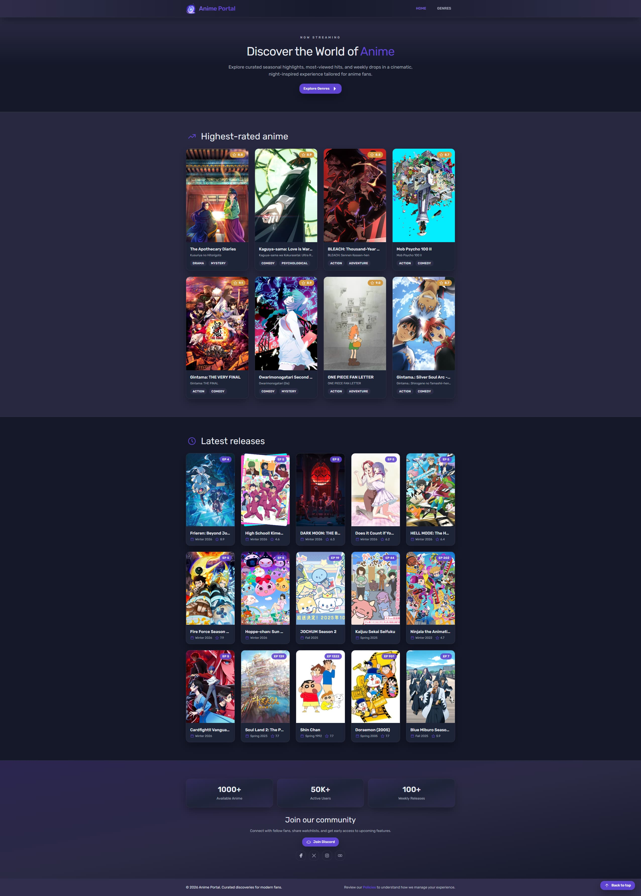
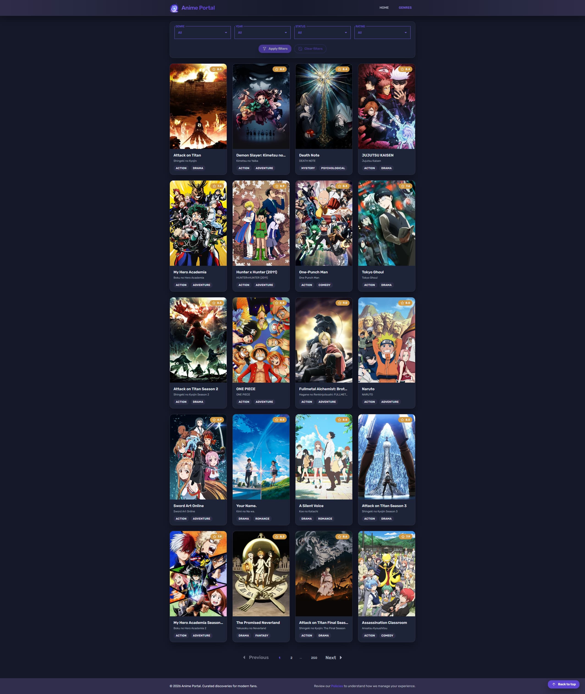
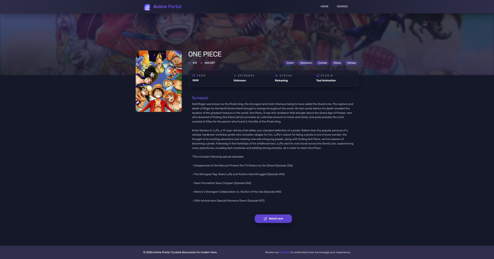



  

  Discover anime through a clean, fast, and modern Angular-powered interface.

  🌐 <a href="https://anime-portal-cyan.vercel.app/">Live Demo</a>

## ✨ Features

- 🔍 Discover anime through curated sections.
- 🎭 Browse anime by genre.
- 📄 Detailed anime pages with structured metadata.
- ⚡ Fast navigation and reusable Angular components.
- 🎨 Consistent design system using Tailwind CSS.
- 🧪 Unit and end-to-end testing setup.
- 📱 Responsive layout focused on clarity and usability.

## 🖼️ Preview

A quick visual overview of the main sections of the application.

<table>
  <tr>
    <td valign="top" width="33%">
      
    </td>
    <td valign="top" width="33%">
      
    </td>
    <td valign="top" width="33%">
      
    </td>
  </tr>
</table>

## 🧠 About the project

Anime Portal is a personal side project built to **practice and explore Angular 21** by developing a real, production-like application.

- 🧱 Clean and scalable component architecture.
- ♻️ Reusable UI components.
- 🔐 Strongly typed data from external APIs.
- 🧭 Clear separation between UI, data, and logic.

The app includes list views, detail pages, and shared components designed to stay consistent as the project grows.

## 🛰️ Data & API

- 🛰️ **Source:** AniList API
- 🧠 **Data handling:** Mapped into strongly typed models before rendering
- 🔗 **API endpoint:** https://anilist.co

## 🏗️ Architecture overview

- 🧩 Feature-based folder structure.
- 🧱 Standalone Angular components.
- 🛰️ Centralized API service layer.
- 🔐 Strong TypeScript typing for external data.
- ♻️ Reusable UI components and shared styles.
- 🎨 Tailwind CSS for design consistency.

## 🚀 Getting started

- 📦 Install dependencies: `pnpm install`
- ▶️ Run the development server: `pnpm start`
- 🌐 Open in your browser: `http://localhost:4200/`

## 🧪 Tests

- 🧩 Unit tests (Vitest): `pnpm test`
- 🌐 E2E tests (Playwright): `pnpm test:e2e`
- 📊 Coverage: `pnpm test:coverage` (output in `coverage/`)

## 🧰 Tech stack

- 🎨 **Frontend:** Angular 21 · TypeScript · Tailwind CSS
- 🧪 **Testing:** Vitest · Playwright
- 🛠️ **Tooling & Platform:** pnpm · Git · Vercel
- 🛰️ **Data:** AniList API
- 🤖 **Development:** AI-assisted development

## 🛣️ Roadmap

Planned improvements for future versions:

- 📄 Expand anime detail pages (more metadata, relations, and richer sections)
- 📱 Improve responsive design and mobile UX
- 🌍 Add multi-language support (i18n)
- 🔎 Add a global anime search in the navbar
- ⚡ Performance optimizations (load time, caching, and rendering)
- 🎛️ Improve genre page filters (better sorting and discoverability)
